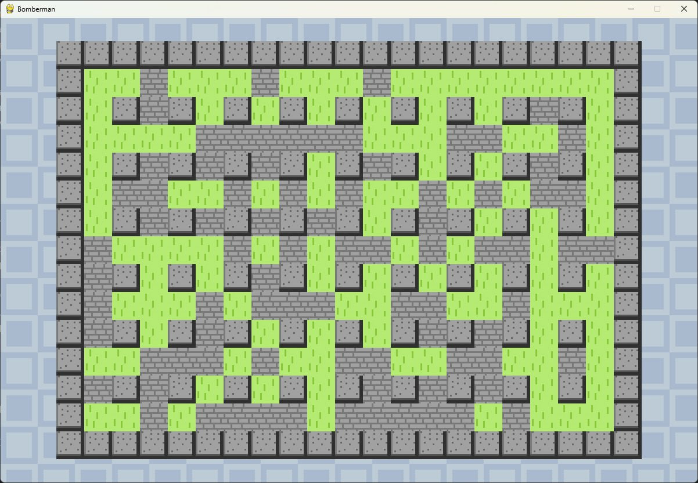
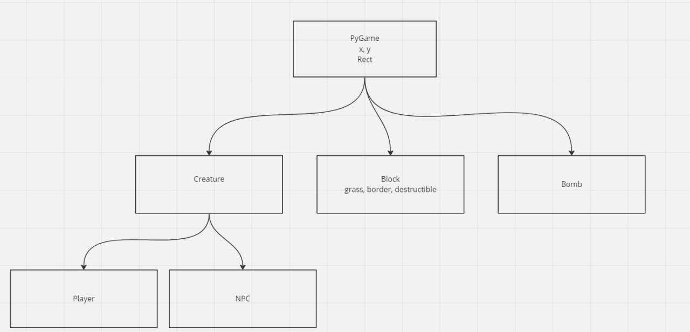

# BomberMan

Список объектов
* Creature
  * x,y
  * speed
  * skin
  * hitbox
  * life = 3

* Player (Creature)
  * bomb_count

* TileType(Enum)
  * BORDER, GRASS, DESTRUCTIBLE = 0, 1, 2

* Tile
  * x, y
  * Type (GRASS, BORDER, DESTRUCTIBLE = 0, 1, 2)
  * hitbox
  * image

* Map 
  * map_width
  * map_height 
  * tiles_map list[Tile]
  * horizontal_offset (for now)
  * vertical_offset (for now)

* keyboardInput
  * def keyEvent()
---
### Controls
Exit game: ESC 
#### Player 1
Arrows: UP, DOWN, LEFT , RIGHT
Drop bomb: O
Action: P

#### Player 2
Arrows: W, A, S , D
Drop bomb: F
Action: G

---

* Menu
  * start -> main loop
  * exit -> close game

* Bomb
  * x,y
  * hitbox
  * power
  * timer
 
* NPC
  * movement

## todo
* количество игроков 1-4 (игра на одной клавиатуре)
* место спавна
  * отдельный класс? механика
  * png
  * область генерации tile destruct около спавна
* Ускоерение = Марио
